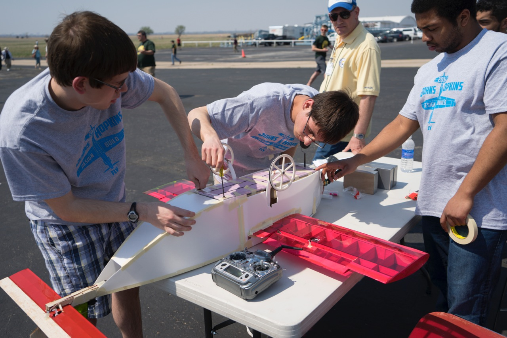
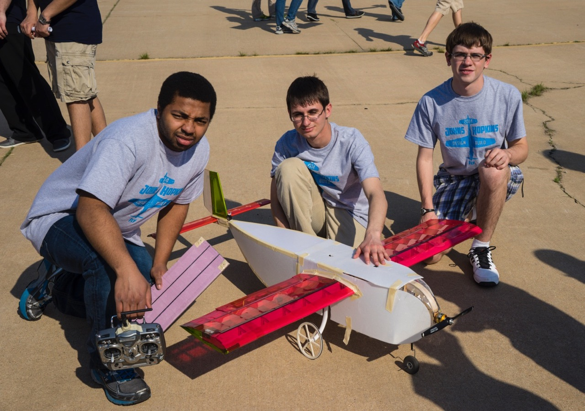
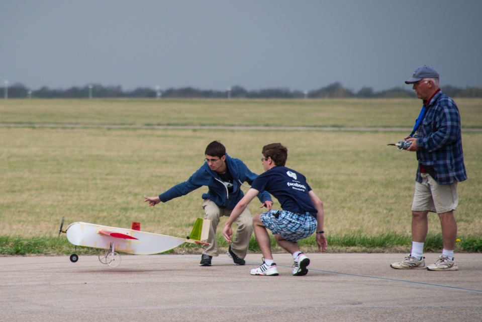
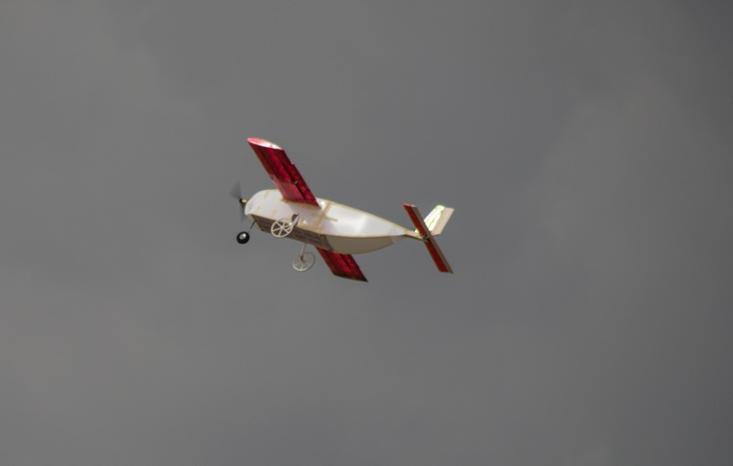


  
  
  
  


During my undergraduate studies at Johns Hopkins, I participated in Design/Build/Fly, which is an AIAA-sponsored RC aircraft competition.
I joined the team as a freshman, and in my junior year I became the club president and chief engineer.
These pictures are from my first year as club president at the 2014 competition in Wichita, Kansas.