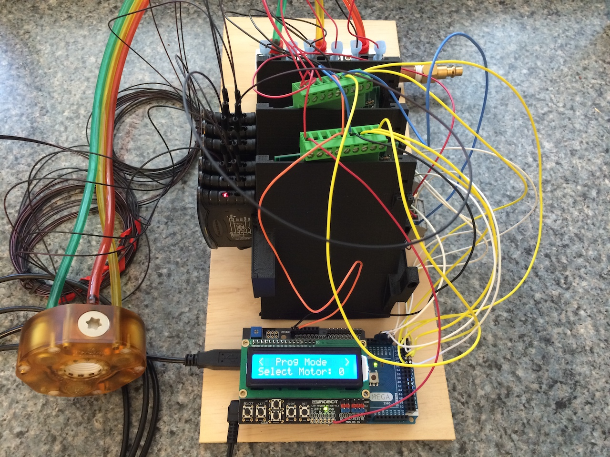
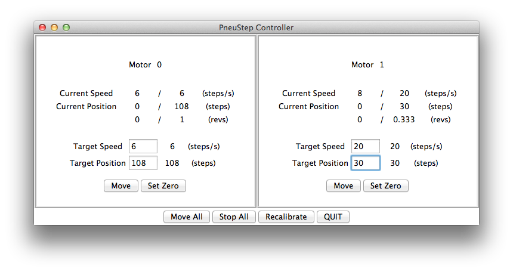
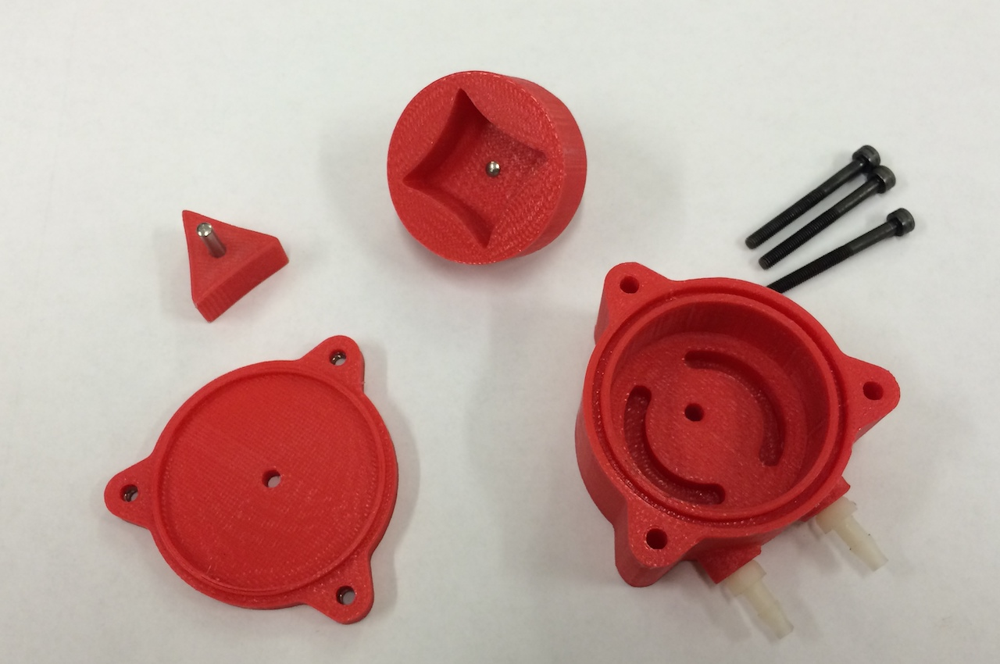


  
  
  


While at Johns Hopkins, I did some summer research with Professor Dan Stoianovici at the JHU Bayview Medical Campus.
His lab builds robots that can work inside an MRI scanner, which means they cannot use any magnetic or electrical parts.
The motors are plastic pneumatic stepper motors, and encoder signals are sent by fiber optic cable instead of copper wire.

My role was to develop a simpler, low-cost solution to test the pneumatic stepper motors.
I developed an Arduino-based system to allow a user to control multiple motors at a time.
Commands could be issued by navigating a UI on an LCD screen with push buttons, or the system could be plugged into a computer to use a clickable GUI.

I also helped investigate some alternative plastic motor designs, including a pneumatic gerotor. 
My contribution was to write Matlab code to generate trochoid curves that we could import into Creo to manufacture the inner and outer gears.

