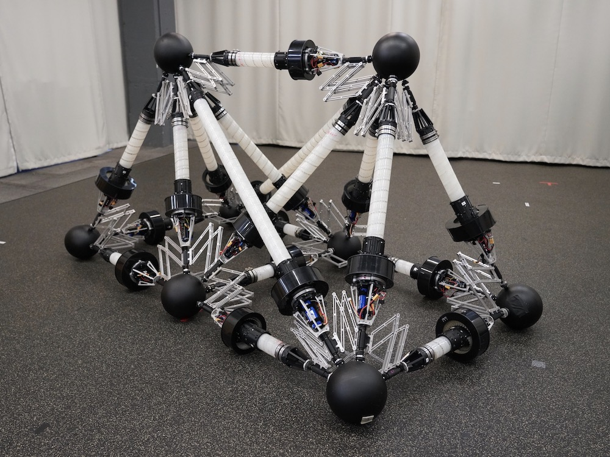
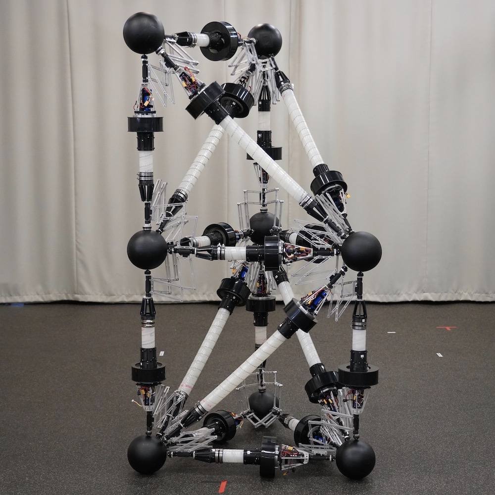

My research at Penn primarily centers around the Variable Topology Truss (VTT) system.
VTT is a novel kind of modular self-reconfigurable robot (MSRR).
The idea behind modular robots is that instead of building a single complicated robot, we can build a collection of composable robot modules. 
By snapping the modules together in different ways, we can make a variety of robot shapes with different capabilities.
These robot configurations wouldn't be as efficient as a custom-built robot for any single task, but the ability to reconfigure means that the whole system can accomplish a much wider variety of tasks.
Self-reconfigurable modular robots takes this one step further: the robot can rearrange itself without human intervention.
This is especially attractive for scenarios like autonomous space missions, where the payload weight is limited but a wide variety of tasks will need to be addressed, some of which might be not be planned in advance.

Most proposed MSRR systems use cube-like modules that can connect on a lattice or link together as a chain.
One example developed here at Penn is [SMORES](https://www.modlabupenn.org/smores-ep/), which can do both lattice and chain-style reconfiguration.
However, this cube-like foundation presents some issues with scaling the system up.
These systems tend to have poor structural efficiency and actuation capability.
<!-- If you think about an arm constructed out of these homogeneous cube modules, as the arm gets longer the module at the shoulder will struggle to lift the whole arm.
This is why typical robot arms tend to have much larger actuators towards their base. -->

The idea with VTT is to change the underlying architecture to make the system much stronger and lighter.
Instead of using cube elements, we will use extendable beam elements as the fundamental building block.
If traditional modular robots are like using bricks to build an arch bridge, then VTT is like using beams to build a structurally efficient truss bridge.
Here is what these beam modules look like:



With these modules, we can build a variety of 3D truss structures.
At the top of this page, you can see us giving a live demo of an octahedron configuration at ICRA 2022.
Robotic trusses built with these modules can morph their shape to [move around in the world](https://youtu.be/AAJGrTAP9Gs), and the system can even [change its own configuration](https://www.modlabupenn.org/topological-reconfiguration-planning-for-a-variable-topology-truss/) using special self-reconfigurable joints.

My main research work concerns the **reconfiguration and motion planning** problem.
That is, given some start and goal configurations---for example, the two trusses shown below---how can we find some sequence of robot motions to transform into the goal?
The parallel nature of the truss robot architecture makes this a surprisingly challenging problem.


  
  


Aside from motion planning, I also work on the hardware design and control software for the robot.
Developing this robot system has been a collaborative effort from many Modlab members, but I have led the hardware design for the last few years.
I have also redesigned the electronics, updated the messaging system, and rewritten the control software in ROS2.
<!--These efforts have improved the robustness of the system to the point that we -->

